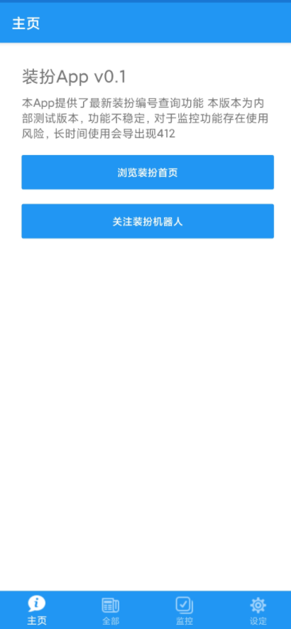

# 装扮App

装扮是 bilibili 提供的一种个性化装饰，包括主题、表情包、空间背景等。

为了方便大家使用相关的功能, 减少一些手动操作, 所以开发了该 App.

由于我本身也是初学者, 所以都是按照自己的理解随意做的, 代码实现都会比较蠢, 并且可能有一些严重 BUG, 我会尽力改进.

由于存在政策风险 --》比如说被 B站 封号，所以决定归档了，后续不再进行功能开发了

如果想要使用， 可以从 github 的 prerelease 中自取

## Get Started

从 github 的 prerelease 中, 可以下载到最新版本, 由于目前仅为开发版本, 所以功能本身不稳定.

目前 0.1 版本仅实现了查看全部装扮的功能, 其他功能计划后续添加.

对于使用者而言, 需要 Android-11 及以上版本

## 其他

